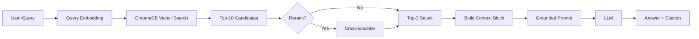

# Architecture — RAG Pipeline (Day 08 Lab)

> Template: Điền vào các mục này khi hoàn thành từng sprint.
> Deliverable của Documentation Owner.

## 1. Tổng quan kiến trúc

```
[Raw Docs]
    ↓
[index.py: Preprocess → Chunk → Embed → Store]
    ↓
[ChromaDB Vector Store]
    ↓
[rag_answer.py: Query → Retrieve → Rerank → Generate]
    ↓
[Grounded Answer + Citation]
```

**Mô tả ngắn gọn:**
> Nhóm xây dựng một RAG pipeline cho trợ lý nội bộ khối CS + IT Helpdesk để trả lời câu hỏi vận hành bằng bằng chứng từ tài liệu chính sách. Hệ thống xử lý theo chuỗi preprocess -> chunk -> embed -> lưu vector vào ChromaDB, sau đó retrieval và generation có citation nguồn. Ở Sprint 1, pipeline đã index thành công 5 tài liệu với tổng 29 chunks và metadata đầy đủ để phục vụ retrieval, freshness và kiểm chứng nguồn.

---

## 2. Indexing Pipeline (Sprint 1)

### Tài liệu được index
| File | Nguồn | Department | Số chunk |
|------|-------|-----------|---------|
| `policy_refund_v4.txt` | policy/refund-v4.pdf | CS | 6 |
| `sla_p1_2026.txt` | support/sla-p1-2026.pdf | IT | 5 |
| `access_control_sop.txt` | it/access-control-sop.md | IT Security | 7 |
| `it_helpdesk_faq.txt` | support/helpdesk-faq.md | IT | 6 |
| `hr_leave_policy.txt` | hr/leave-policy-2026.pdf | HR | 5 |

### Quyết định chunking
| Tham số | Giá trị | Lý do |
|---------|---------|-------|
| Chunk size | 400 tokens (xấp xỉ) | Cân bằng giữa giữ đủ ngữ cảnh điều khoản và không làm chunk quá dài cho retrieval |
| Overlap | 80 tokens (xấp xỉ) | Giảm mất mát thông tin ở biên chunk, đặc biệt với câu dài hoặc bullet list |
| Chunking strategy | Heading-based trước, sau đó paragraph-based khi section dài | Ưu tiên ranh giới tự nhiên theo section (=== ... ===), chỉ tách nhỏ tiếp khi vượt ngưỡng kích thước |
| Metadata fields | source, section, effective_date, department, access | Phục vụ filter, freshness, citation |

### Embedding model
- **Model**: OpenAI `text-embedding-3-small`
- **Vector store**: ChromaDB (PersistentClient)
- **Similarity metric**: Cosine

**Kết quả kiểm tra Sprint 1 (runtime):**
- Build index thành công cho 5 tài liệu, tổng 29 chunks.
- Phân bố theo department: IT Security (7), HR (5), IT (11), CS (6).
- Chunks thiếu `effective_date`: 0.

---

## 3. Retrieval Pipeline (Sprint 2 + 3)

### Baseline (Sprint 2)
| Tham số | Giá trị |
|---------|---------|
| Strategy | Dense (embedding similarity) |
| Top-k search | 10 |
| Top-k select | 3 |
| Rerank | Không |

### Variant (Sprint 3)
| Tham số | Giá trị | Thay đổi so với baseline |
|---------|---------|------------------------|
| Strategy | Rerank | Thêm bước xếp hạng lại sau dense retrieval để ưu tiên chunk liên quan nhất theo ngữ nghĩa câu hỏi |
| Top-k search | 10 | Giữ nguyên để vẫn đảm bảo recall trước khi lọc lại bằng rerank |
| Top-k select | 3 | Giữ nguyên đầu ra để so sánh công bằng với baseline, chỉ thay đổi chất lượng top-3 |
| Rerank | cross-encoder  | Baseline không có rerank; cross-encoder giúp giảm nhiễu và tăng precision của context đưa vào LLM |

**Lý do chọn variant này:**
> TODO: Giải thích tại sao chọn biến này để tune.
> Ví dụ: "Chọn hybrid vì corpus có cả câu tự nhiên (policy) lẫn mã lỗi và tên chuyên ngành (SLA ticket P1, ERR-403)."

---

## 4. Generation (Sprint 2)

### Grounded Prompt Template
```
Answer only from the retrieved context below.
If the context is insufficient, say you do not know.
Cite the source field when possible.
Keep your answer short, clear, and factual.

Question: {query}

Context:
[1] {source} | {section} | score={score}
{chunk_text}

[2] ...

Answer:
```

### LLM Configuration
| Tham số | Giá trị |
|---------|---------|
| Model | TODO (gpt-4o-mini / gemini-1.5-flash) |
| Temperature | 0 (để output ổn định cho eval) |
| Max tokens | 512 |

---

## 5. Failure Mode Checklist

> Dùng khi debug — kiểm tra lần lượt: index → retrieval → generation

| Failure Mode | Triệu chứng | Cách kiểm tra |
|-------------|-------------|---------------|
| Index lỗi | Retrieve về docs cũ / sai version | `inspect_metadata_coverage()` trong index.py |
| Chunking tệ | Chunk cắt giữa điều khoản | `list_chunks()` và đọc text preview |
| Retrieval lỗi | Không tìm được expected source | `score_context_recall()` trong eval.py |
| Generation lỗi | Answer không grounded / bịa | `score_faithfulness()` trong eval.py |
| Token overload | Context quá dài → lost in the middle | Kiểm tra độ dài context_block |

---

## 6. Diagram (tùy chọn)

> TODO: Vẽ sơ đồ pipeline nếu có thời gian. Có thể dùng Mermaid hoặc drawio.


