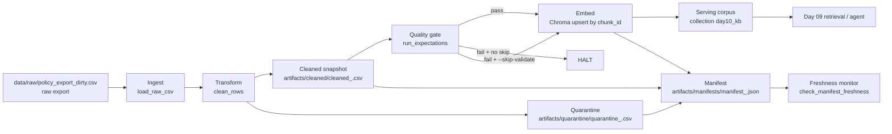

# Kiến trúc pipeline - Lab Day 10

**Nhóm:** X2  
**Cập nhật:** 15/04/2026

---

## 1. Sơ đồ luồng

Luồng thực tế trong `etl_pipeline.py` là `ingest -> clean -> validate -> embed -> manifest -> freshness`.

Các điểm observability bắt buộc:

- Mỗi lần chạy có `run_id` để nối log, cleaned CSV, quarantine CSV và manifest.
- Dữ liệu lỗi không bị xóa âm thầm mà đi vào `artifacts/quarantine/`.
- Manifest ghi lại số lượng record, trạng thái pipeline, trạng thái embed và `latest_exported_at`.
- Freshness được kiểm tra sau khi manifest được ghi, dùng SLA theo `FRESHNESS_SLA_HOURS`.

---

## 2. Ranh giới trách nhiệm

| Thành phần | Input | Output | Trách nhiệm |
|-----------|-------|--------|-------------|
| Ingest | `data/raw/policy_export_dirty.csv` hoặc file CSV truyền qua `--raw` | Danh sách row thô trong bộ nhớ | Đọc export từ nguồn upstream, kiểm tra file tồn tại, log `raw_records` |
| Transform | Row thô | `cleaned` + `quarantine` | Chuẩn hóa dữ liệu, sửa rule business, loại bỏ duplicate, tách record lỗi sang quarantine |
| Quality | `cleaned` rows | Kết quả expectation + cờ `halt` | Chặn publish khi dữ liệu không đạt expectation quan trọng |
| Embed | `artifacts/cleaned/cleaned_<run_id>.csv` | Chroma collection `day10_kb` | Biến cleaned snapshot thành vector store dùng cho retrieval |
| Monitor | Manifest JSON mới tạo | PASS/WARN/FAIL freshness | Theo dõi độ mới dữ liệu và cung cấp tín hiệu vận hành |
| Serving | Chroma collection + metadata `run_id` | Context cho truy vấn retrieval | Cấp dữ liệu sạch cho Day 09 / các bước RAG phía sau |

Chi tiết theo code hiện tại:

- Ingest dùng `load_raw_csv(...)`.
- Transform dùng `clean_rows(...)`, sau đó ghi `cleaned_csv` và `quarantine_csv`.
- Quality dùng `run_expectations(cleaned)`.
- Embed dùng `cmd_embed_internal(...)` với Chroma PersistentClient.
- Monitor dùng `check_manifest_freshness(...)`.

---

## 3. Idempotency và rerun

Chiến lược idempotent của pipeline nằm ở pha embed:

- Mỗi chunk dùng `chunk_id` làm khóa ổn định.
- Chroma ghi bằng `upsert(ids=ids, ...)`, nên rerun cùng dữ liệu sẽ cập nhật thay vì tạo vector trùng.
- Trước khi upsert, pipeline lấy toàn bộ `prev_ids` trong collection và xóa các id không còn xuất hiện trong cleaned snapshot hiện tại.

Ý nghĩa của cách làm này:

- Collection hoạt động như một snapshot publish mới nhất, không phải lịch sử cộng dồn vô hạn.
- Nếu một chunk stale từng tồn tại ở run cũ nhưng đã bị loại khỏi cleaned run mới, chunk đó sẽ bị prune và không còn làm nhiễu top-k retrieval.
- Rerun 2 lần với cùng cleaned data sẽ không sinh duplicate vector.

Trade-off:

- Pipeline đang tối ưu cho "ảnh chụp hiện tại" hơn là lưu toàn bộ lịch sử index.
- Nếu sau này cần audit từng phiên bản corpus trong Chroma, nhóm phải tách collection theo version hoặc lưu lineage sâu hơn ngoài manifest.

---

## 4. Liên hệ Day 09

Day 10 không tạo một bài toán mới mà làm sạch tầng dữ liệu cho đúng use case của Day 09.

Điểm nối cụ thể:

- `day09/lab/data/docs/` và `day10/lab/data/docs/` đang dùng cùng bộ tài liệu nghiệp vụ nền như `policy_refund_v4.txt`, `sla_p1_2026.txt`, `hr_leave_policy.txt`, `it_helpdesk_faq.txt`, `access_control_sop.txt`.
- Day 09 xây chỉ mục từ thư mục docs tĩnh bằng `build_index.py` và lưu vào collection `day09_docs`.
- Day 10 mô phỏng đường ingest "gần nguồn hơn": dữ liệu đi từ raw export bẩn, qua clean và expectation, rồi mới publish sang vector store `day10_kb`.

Về mặt kiến trúc, Day 10 là lớp dữ liệu đứng trước Day 09:

1. Upstream export sinh CSV thô.
2. ETL Day 10 sửa lỗi, loại bản ghi hỏng, chặn publish khi expectation fail.
3. Chỉ cleaned snapshot mới được embed vào Chroma.
4. Retrieval/agent của Day 09 nên đọc từ collection đã publish này nếu muốn tránh dùng chunk stale hoặc sai version.

Lợi ích cho retrieval:

- Giảm nguy cơ top-k chứa chunk sai chính sách hoàn tiền `14 ngày` thay vì `7 ngày`.
- Giảm nguy cơ lẫn bản HR cũ `10 ngày phép` khi policy mới là `12 ngày`.
- Có thể truy vết câu trả lời sai quay về `run_id`, manifest và quarantine tương ứng thay vì chỉ nghi ngờ prompt hay model.

Nói ngắn gọn: Day 09 trả lời đúng hay không phụ thuộc rất mạnh vào Day 10 publish đúng corpus.

---

## 5. Bằng chứng từ run hiện tại

Manifest `artifacts/manifests/manifest_2026-04-15T06-53Z.json` cho thấy:

- `raw_records = 10`
- `cleaned_records = 6`
- `quarantine_records = 4`
- `pipeline_status = "OK"`
- `embed_status = "ok"`
- `chroma_collection = "day10_kb"`

Quarantine mẫu của cùng run cho thấy 4 nhóm lỗi đã bị chặn khỏi publish:

- `duplicate_chunk_text`
- `missing_effective_date`
- `stale_hr_policy_effective_date`
- `unknown_doc_id`

Đây là bằng chứng pipeline đang thực thi đúng ranh giới: dữ liệu nghi ngờ bị cô lập trước khi đi vào vector store.

---

## 6. Rủi ro đã biết

- Freshness hiện dựa trên manifest sau run, nên nếu upstream ngừng xuất dữ liệu nhưng không ai chạy pipeline lại thì cảnh báo vận hành có thể đến muộn.
- Embed đang ghi đè snapshot collection hiện tại; cách này tốt cho serving nhưng chưa đủ cho nhu cầu audit version-by-version trong dài hạn.
- Chất lượng expectation vẫn phụ thuộc vào bộ rule nhóm định nghĩa; nếu rule thiếu, dữ liệu sai nhưng "hợp schema" vẫn có thể lọt qua.
- Pipeline hiện xử lý CSV batch, chưa có cơ chế incremental ingest hoặc retry theo từng partition.
- Day 09 và Day 10 đang song song tồn tại hai collection khác nhau (`day09_docs` và `day10_kb`); nếu không thống nhất nguồn đọc, agent có thể vẫn truy vấn nhầm index cũ.